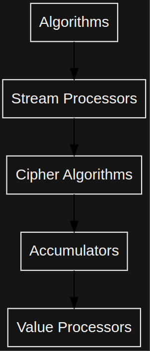

# curves

## Elliptic Curves Architecture 

Curves were build upon the `fields`. So it basically consist of several parts listed below:

1. Curve Policies
2. Curve g1, g2 group element arithmetic
3. Basic curve policies

.png)

###  

### &#x20;

### Curve Policies 

A curve policy describes its parameters such as base field modulus `p`, scalar field modulus `q`, group element types `g1_type` and `g2_type`. It also contains `pairing_policy` type, needed for comfortable usage of curve pairing.

### Curve Element Algorithms 

Curve element corresponds an point of the curve and has all the needed methods and overloaded arithmetic operators. The corresponding algorithms are based on the underlying field algorithms are also defined here.

### Basic Curve Policies 

Main reason for existence of basic policy is is that we need some of it params using in group element and pairing arithmetic. So it contains such parameters that are needed by group element arithmetic e.g. coeffs `a` and `b` or generator coordinates `x`, `y`. It also contains all needed information about the underlying fields.
