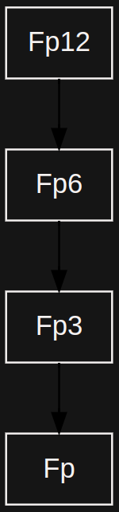

# field

## Field Architecture 

Fields are a wrapper over `multiprecision` module and concept of `modular_adaptor` number. So it basically consist of several parts listed below:

1. Field Policies
2. Field Extensions (e.g. Fp2, Fp4)
3. Field Parameters
4. Field Element Algorithms, which are actually wrappers over the `multiprecision` operations.

### .png>) 

### Field Policies 

A field policy describes its essential parameters such as `modulus`, `arity` or `mul_generator` - multiply generator.

### Field Extensions 

For the purposes of effective field/elliptic curve operations and pairings evaluation fields are arranged as a field tower.

For example, this is the tower used for `bn128` and `bls12_381` operations and pairings evaluation:

Fp -> Fp2 -> Fp6 -> Fp12;

.png>)

There are also the following towers implemented:

Fp -> Fp3 -> Fp6 -> Fp12;

Fp -> Fp2 -> Fp4 -> Fp12;

.png>)

### Field Parameters 

Other field parameters are kept in the specific structures. All this structures inherit from basic `params` structure, containing all the basic parameters.

For example, `extension_params` structure keeps all the parameters needed for field and field extensions arithmetical operation evaluations.

### Field Algorithms 

Field element corresponds an element of the field and has all the needed methods and overloaded arithmetic operators. The corresponding algorithms are also defined here. As the backend they use now Boost::multiprecision, but it can be easily changed.

### &#x20;
